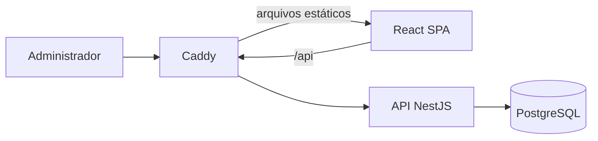

# ag-brain

PoC de um CRM rural para administrar produtores, fazendas, safras, culturas e indicadores em uma interface responsiva.

## Demonstração

- **Link**: https://fabricio-agbrain.duckdns.org
- **Host**: Oracle - VM.Standard.E3.Flex + DuckDNS
- **Perfil**: `Admin`
- **Senha**: `AdminPass*`

### Vídeo — 2x

https://github.com/user-attachments/assets/30bd724e-2398-41bd-9508-fb4f175c7545

> Assistir em 1x -> `github.com/user-attachments/assets/0713f91a-acc5-47c6-bfb7-33c46bbbc7f3`

## Funcionalidades

- Dashboard geral ou por produtor, com KPIs e gráficos por estado, cultura, uso do solo e evolução de área.
- CRUD de produtores com validação de CPF e CNPJ, inclusive alfanumérico.
- CRUD de fazendas com validação da distribuição das áreas.
- CRUD de safras, com uma safra por fazenda/ano e culturas normalizadas.
- Auditoria de operações bem-sucedidas e falhas, com filtros e detalhes da requisição.
- Autenticação administrativa por sessão segura em cookie.

## Arquitetura



O projeto usa um **monólito modular**: simples de implantar como PoC, mas separado por domínio para continuar fácil de manter.

```text
client/  React, módulos de negócio e componentes compartilhados
server/  API, regras de negócio, persistência, migrações e testes
```

## Decisões principais

- Regras de negócio ficam nos casos de uso e também são protegidas por restrições do PostgreSQL.
- Migrações versionadas substituem sincronização automática do banco.
- TanStack Query concentra o estado remoto; cada funcionalidade do React mantém sua API, modelo e tela.
- Senhas usam `scrypt`; sessões opacas ficam em cookies `HttpOnly` e somente o hash do token é salvo.
- Caddy entrega o React, encaminha `/api` e renova HTTPS automaticamente.
- Logs de auditoria e `X-Request-Id` tornam as operações rastreáveis.

## Tecnologias

- **Frontend:** React 19, TypeScript, Vite, Tailwind, shadcn/ui e TanStack Query.
- **Backend:** Node.js 24, NestJS 11, TypeORM e PostgreSQL 17.
- **Infraestrutura:** Docker Compose e Caddy 2.
- **Testes:** Vitest, Testing Library e Playwright.

## Executar com Docker

Requisitos: Docker Engine e Docker Compose.

```bash
cp .env.example .env
```

Edite `.env`. Para HTTPS com domínio:

```dotenv
APP_ADDRESS=agbrain.example.com
APP_URL=https://agbrain.example.com
SESSION_SECURE_COOKIE=true

ADMIN_NAME=Administrator
ADMIN_EMAIL=admin@example.com
ADMIN_PASSWORD=troque-por-uma-senha-forte

DB_PASSWORD=troque-por-outra-senha-forte
```

Use uma senha administrativa com pelo menos 8 caracteres.

```bash
docker compose config
docker compose up -d --build
docker compose ps
```

Na primeira execução, as migrações e o seed criam o administrador e os dados de demonstração. Alterar `ADMIN_PASSWORD` depois não modifica um usuário já existente.

### Verificar

```bash
curl --fail https://agbrain.example.com/health
docker compose logs --tail=100 api client postgres
```

## Desenvolvimento local

Em terminais separados:

```bash
docker compose up -d postgres
```

```bash
cd server
npm install
npm run db:seed
npm run dev
```

```bash
cd client
npm install
npm run dev
```

Frontend: `http://localhost:5173`. API: `http://127.0.0.1:3333`.

## API

Os endpoints usam o prefixo `/api/v1`. Consulte o [OpenAPI](server/openapi/openapi.yaml) ou importe a [coleção do Postman](docs/postman/AgBrain.postman_collection.json).

## Qualidade

```bash
cd server
npm run format:check
npm run typecheck
npm run test:unit
npm run test:e2e
npm run build
```

```bash
cd client
npm run format:check
npm run lint
npm run typecheck
npm run test:unit
npm run test:e2e
npm run build
```

## Implantação

```text
Internet -> Caddy + React -> NestJS API -> PostgreSQL
             :80/:443         private       persistent volume
```

Libere apenas as portas `80` e `443`. API e PostgreSQL permanecem acessíveis somente pelo host.

### Atualizar sem perder dados

```bash
git pull --ff-only
docker compose build --pull
docker compose up -d --remove-orphans
```

Os volumes do PostgreSQL e do Caddy sobrevivem à recriação dos containers.

Se alterou apenas `.env`, aplique com:

```bash
docker compose up -d --force-recreate api client
```

### Apagar tudo e recomeçar

```bash
docker compose down -v --remove-orphans
docker compose up -d --build
```

> `down -v` apaga definitivamente o banco e os certificados. Não use em uma atualização normal.

---

Written with heart by fparol4
