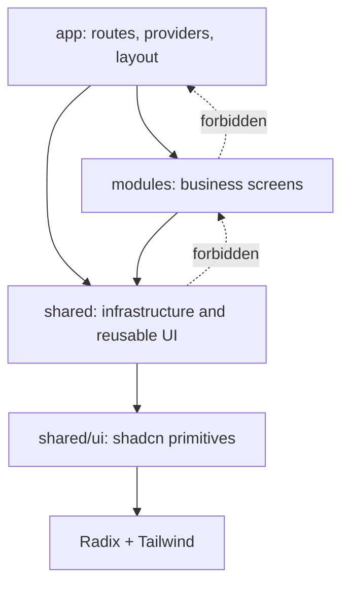
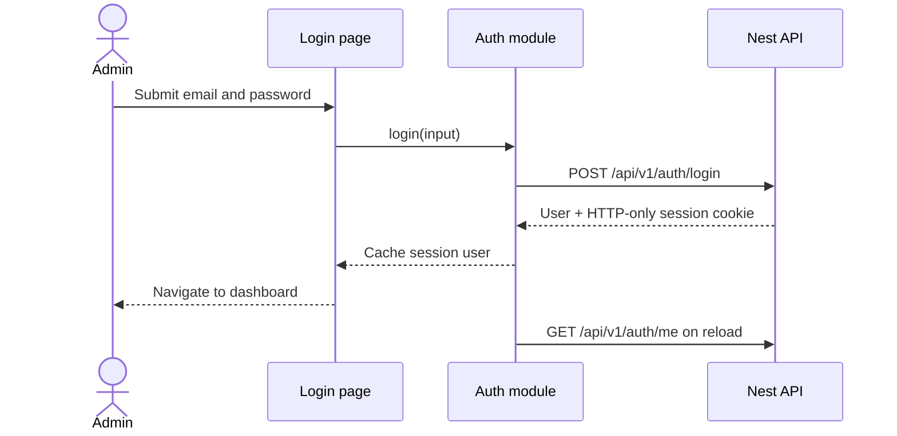
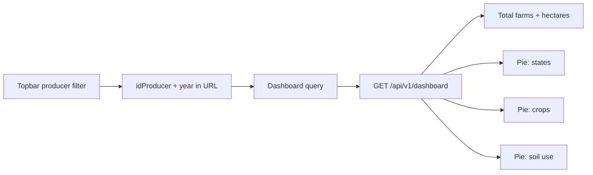
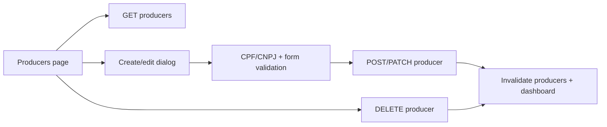
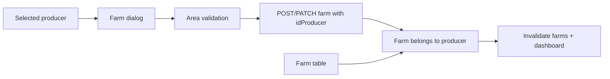
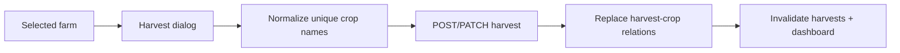
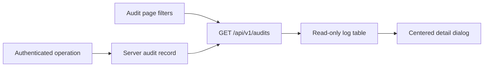

# Client simplification and functionality diagrams

## Objective

Keep the client small, feature-oriented, and easy to navigate while preserving the current UI and API behavior. This plan changes organization first; it does not redesign screens or API contracts.

## 1. shadcn boundary

shadcn components are source files copied into the project, not a normal runtime component package. They therefore remain in the repository, but they can have a strict boundary.

Recommended rules:

- Keep generated/adapted shadcn primitives only in `src/shared/ui/`.
- Configure `components.json` so the shadcn `ui` alias points to `@/shared/ui`.
- Never import application modules, API code, or domain types from `shared/ui`.
- Put application-specific reusable components in `src/shared/components/`.
- Prefer direct imports such as `@/shared/ui/button`; do not add a large barrel file.
- Treat `shared/ui` as replaceable infrastructure. Domain behavior belongs in modules.

Fully excluding shadcn files from the codebase would require generating them during installation or maintaining a separate package. That adds complexity and is not recommended for this application.

## 2. Recommended architecture

```text
src/
├── app/
│   ├── layout.tsx
│   ├── providers.tsx
│   ├── query-client.ts
│   ├── routes.tsx
│   └── producer-scope.ts
├── modules/
│   ├── auth/
│   │   ├── api.ts
│   │   ├── model.ts
│   │   ├── use-auth.ts
│   │   └── login-page.tsx
│   ├── dashboard/
│   │   ├── api.ts
│   │   ├── model.ts
│   │   ├── charts.tsx
│   │   └── page.tsx
│   ├── producers/
│   │   ├── api.ts
│   │   ├── model.ts
│   │   ├── dialog.tsx
│   │   └── page.tsx
│   ├── farms/
│   │   ├── api.ts
│   │   ├── model.ts
│   │   ├── area-validator.tsx
│   │   ├── dialog.tsx
│   │   └── page.tsx
│   ├── harvests/
│   │   ├── api.ts
│   │   ├── model.ts
│   │   ├── dialog.tsx
│   │   └── page.tsx
│   └── audit/
│       ├── api.ts
│       ├── model.ts
│       ├── labels.ts
│       ├── detail-dialog.tsx
│       └── page.tsx
├── shared/
│   ├── ui/                 # shadcn only
│   ├── components/         # reusable application components
│   ├── api/
│   │   ├── client.ts
│   │   └── errors.ts
│   └── lib/
│       ├── brazilian-states.ts
│       ├── format.ts
│       ├── pagination.ts
│       └── cn.ts
├── index.css
└── main.tsx
tests/
├── setup.ts
├── unit/                    # mirrors the production source tree
└── e2e/
```

### Simplification rules

- Each module starts with `api.ts`, `model.ts`, and `page.tsx`.
- Combine the current feature `types` and `schema` files into `model.ts` when both are small.
- Add a separate component file only when it is reusable or keeps the page readable.
- Keep every test under `tests/`, mirroring the behavior it covers.
- Do not create generic global folders named `hooks`, `services`, `types`, or `utils`.
- Use TanStack Query for remote state; do not add another store unless genuine client-only shared state appears.

## 3. Dependency direction



## 4. Functionality diagrams

### Authentication



### Dashboard and producer scope



### Producers



### Farms



### Harvests



### Audit



## 5. Execution plan

1. Record the current passing baseline: format, typecheck, lint, unit tests, build, and browser smoke tests.
2. Move `components/ui` to `shared/ui` and update `components.json` plus imports. Make no visual changes.
3. Move application-level reusable components to `shared/components`; move the shell to `app/layout.tsx`.
4. Move `lib/api.ts` and error handling to `shared/api`; move remaining stable helpers to `shared/lib`.
5. Rename `features` to `modules`, one module at a time, keeping routes working after every move.
6. Merge small `*.types.ts` and `*.schema.ts` pairs into module `model.ts` files.
7. Remove empty folders and old files only after import searches confirm they are unused.
8. Run all client checks and exercise login, dashboard scope, producer CRUD, farm ownership, harvest crop replacement, and audit details.
9. Rebuild the Docker client image or use the Vite development server to verify the final UI.

## 6. Acceptance criteria

- `shared/ui` contains only shadcn-style primitives and their UI-only helpers.
- Modules never import from one another except for explicit domain dependencies such as farms using producer option types/API and harvests using farm options.
- No API contract or visible behavior changes during the reorganization.
- Every route remains lazy-loaded.
- Existing unit and E2E tests pass.
- A developer can locate any feature entry point within two directory levels under `modules/`.
